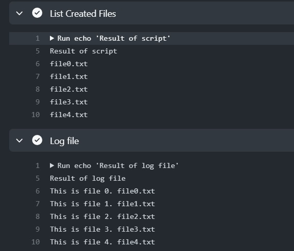

# PowerShell Task

Please create a PowerShell script named `createFiles.ps1` that creates 5 text files named `file` followed by a file number starting from 0, with the extension `.txt`. For example, the files should be named `file0.txt`, `file1.txt`, and so on. Save information about the file creation in a file named `files.log`. Finally, output the contents of the `files.log` file.

Push your script into the repository and check it in GitHub Actions to ensure that the script works properly:

